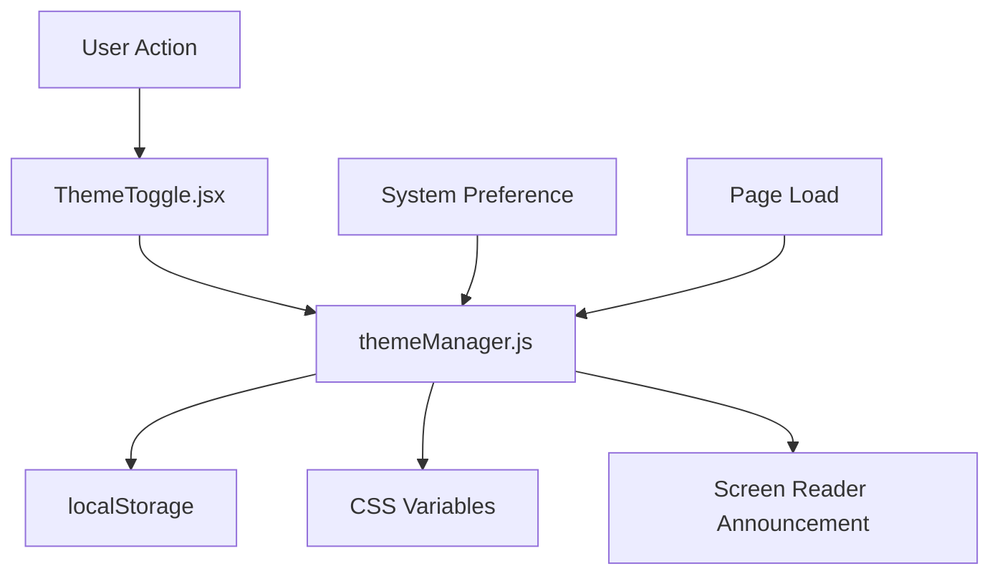

# Dark/Light Mode Toggle Implementation Plan

## Overview
This plan provides a comprehensive step-by-step guide to implement a persistent, high-performance dark/light mode toggle that meets all requirements specified in PLAN.md. The implementation will enhance the existing theme system with improved performance, accessibility, and user experience.

## Current State Analysis
- ✅ Basic theme toggle exists in `src/components/ThemeToggleButton.astro`
- ✅ Theme persistence via localStorage in `src/layouts/BaseLayout.astro`
- ✅ CSS variables defined in `src/styles/global.css`
- ✅ Tailwind dark mode configured in `tailwind.config.js`
- ❌ Missing React component for better state management
- ❌ No system preference detection
- ❌ Performance optimizations needed
- ❌ Accessibility improvements required
- ❌ Documentation updates needed

## Success Criteria (from PLAN.md)
### Functional Requirements
- [ ] Smooth transition between themes without page reload
- [ ] System preference detection on initial load
- [ ] Manual toggle with visual feedback
- [ ] Persistent user preference across sessions

### Performance Criteria
- [ ] Theme switch completes within 100ms
- [ ] No layout shift during theme change
- [ ] Minimal impact on initial bundle size (<5KB)

### Accessibility Criteria
- [ ] Toggle button accessible via keyboard
- [ ] Screen reader announces theme changes
- [ ] High contrast mode compatibility

## Implementation Steps

### Phase 1: Configuration Updates
**Priority**: 1
**Estimated Time**: 30 minutes

#### 1.1 Update Tailwind Configuration
- **File**: `tailwind.config.js`
- **Action**: Ensure dark mode class strategy is properly configured
- **Details**: Verify `darkMode: 'class'` is set and all color variables are defined

#### 1.2 CSS Variables Audit
- **File**: `src/styles/global.css`
- **Action**: Review and complete CSS custom properties for theming
- **Details**: Ensure all semantic colors have light/dark variants

### Phase 2: Core Theme Management System
**Priority**: 1
**Estimated Time**: 1.5 hours

#### 2.1 Create Theme Manager Script
- **File**: `src/scripts/themeManager.js`
- **Purpose**: Centralized theme management with system preference detection - SINGLE SOURCE OF TRUTH
- **Features**:
  - System preference detection (`prefers-color-scheme`)
  - localStorage persistence
  - Event-driven architecture with custom events
  - Dispatches `themechange` event on document after theme changes
  - No-FOUC (Flash of Unstyled Content) prevention
  - Performance optimizations

#### 2.2 Update Base Layout Integration
- **File**: `src/layouts/BaseLayout.astro`
- **Action**: Replace inline theme script with themeManager.js
- **Details**: Use `is:inline` directive for immediate execution

### Phase 3: React Component Development
**Priority**: 1
**Estimated Time**: 2 hours

#### 3.1 Create Theme Toggle Component
- **File**: `src/components/ThemeToggle.jsx`
- **Type**: React functional component with hooks
- **Features**:
  - Accessible button with ARIA attributes
  - Smooth icon transitions
  - Keyboard navigation support
  - Screen reader announcements
  - Visual feedback for theme changes
  - **Resilient state management**: Uses `useEffect` hook to listen for global `themechange` events
  - **Reactive updates**: Updates internal state based on document.documentElement classList
  - **Initial state**: Reads current theme from `document.documentElement.classList.contains('dark')`

#### 3.2 Icon System
- **Library**: Heroicons (or existing SVG icons)
- **States**: Sun (light mode), Moon (dark mode)
- **Animations**: Smooth transitions between states

### Phase 4: Integration & Testing
**Priority**: 1
**Estimated Time**: 1 hour

#### 4.1 Header Component Updates
- **File**: `src/components/Header.astro`
- **Action**: Replace Astro theme toggle with React component
- **Details**: Use `client:load` directive for hydration

#### 4.2 Mobile Menu Integration
- **Action**: Ensure theme toggle works in mobile menu
- **Details**: Consistent behavior across all screen sizes

### Phase 5: Performance Optimization
**Priority**: 2
**Estimated Time**: 1 hour

#### 5.1 Bundle Size Optimization
- **Action**: The core `themeManager.js` script will be minimal and inlined to prevent FOUC
- **Target**: <5KB additional bundle size

#### 5.2 Component Loading Strategy
- **Action**: The React component (`ThemeToggle.jsx`) will be lazy-loaded via Astro's `client:load` directive to optimize the initial page load
- **Details**: Use CSS custom properties for instant theme switching without re-renders

### Phase 6: Accessibility Enhancement
**Priority**: 1
**Estimated Time**: 30 minutes

#### 6.1 ARIA Implementation
- **Attributes**: `aria-pressed`, `aria-label`, `aria-live`
- **Announcements**: Theme change notifications for screen readers

#### 6.2 Keyboard Navigation
- **Support**: Tab, Enter, Space key interactions
- **Focus Management**: Proper focus indicators

### Phase 7: Documentation & Testing
**Priority**: 2
**Estimated Time**: 30 minutes

#### 7.1 Feature Documentation
- **File**: `documentation/features/2025-07-23/dark-mode-toggle.md`
- **Content**: Usage guide, API reference, accessibility notes

#### 7.2 Update PLAN.md
- **Action**: Mark dark mode toggle as completed
- **Details**: Update status and add implementation notes

## Technical Architecture

### File Structure
```
src/
├── components/
│   ├── ThemeToggle.jsx (NEW - React component)
│   └── ThemeToggleButton.astro (EXISTING - to be deprecated)
├── scripts/
│   └── themeManager.js (NEW - Core theme logic)
├── layouts/
│   └── BaseLayout.astro (MODIFIED - Update integration)
└── styles/
    └── global.css (MODIFIED - CSS variables)
```

### Data Flow


### Performance Strategy
- **Inline Script**: Prevents FOUC by setting theme before render
- **Lazy Loading**: React component loads after page content
- **CSS Variables**: Instant theme switching without re-renders
- **Event Delegation**: Minimal event listeners

## Implementation Details

### Theme Manager Script (`src/scripts/themeManager.js`)
```javascript
// Core functionality:
// 1. Detect system preference
// 2. Load user preference from localStorage
// 3. Apply theme immediately (prevent FOUC)
// 4. Provide API for theme changes
// 5. Emit events for component updates
```

### React Component (`src/components/ThemeToggle.jsx`)
```jsx
// Features:
// - Accessible button with proper ARIA
// - Smooth icon transitions
// - Keyboard support
// - Screen reader announcements
// - Visual feedback
```

### CSS Integration
```css
// Strategy:
// - CSS custom properties for instant updates
// - Transition classes for smooth animations
// - High contrast mode support
// - Reduced motion preferences
```

## Testing Checklist

### Functional Testing
- [ ] Theme toggle works on all pages
- [ ] Preference persists across sessions
- [ ] System preference detection works
- [ ] Mobile menu integration functional

### Performance Testing
- [ ] Theme switch <100ms
- [ ] No layout shift during changes
- [ ] Bundle size <5KB increase
- [ ] Lighthouse score maintained

### Accessibility Testing
- [ ] Keyboard navigation works
- [ ] Screen reader announces changes
- [ ] High contrast mode compatible
- [ ] Focus indicators visible

### Cross-browser Testing
- [ ] Chrome 90+
- [ ] Firefox 88+
- [ ] Safari 14+
- [ ] Edge 90+

## Rollback Plan
If issues arise, the following rollback steps are available:
1. Revert to existing `ThemeToggleButton.astro`
2. Restore original inline script in `BaseLayout.astro`
3. Keep existing CSS variable system (already functional)

## Success Metrics
Upon completion, verify:
- [ ] All success criteria from PLAN.md are met
- [ ] No regression in existing functionality
- [ ] Performance metrics within acceptable ranges
- [ ] Accessibility audit passes

## Next Steps
1. Review and approve this plan
2. Switch to Orchestrator mode for implementation
3. Execute each phase sequentially
4. Test thoroughly before deployment