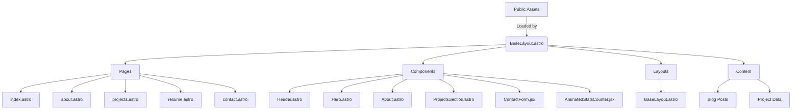

[← Home](../README.md) | [Documentation Overview](README.md) | [Components](COMPONENTS.md) | [Content Management](CONTENT_MANAGEMENT.md) | [Style Guide](STYLE_GUIDE.md)

---
# Project Architecture Overview

## Key Architectural Decisions

### Component-Based Design
The project follows a modular component architecture where:
- **Layout components** (`BaseLayout.astro`) provide the overall page structure
- **Page components** (`src/pages/*.astro`) compose specific content sections
- **UI components** (`src/components/*`) implement reusable interface elements

### Styling Approach
- Uses Tailwind CSS for utility-first styling
- Custom CSS variables for theme management
- Global styles defined in `src/styles/global.css`

### State Management
- Client-side interactivity handled through React components (JSX)
- Theme state persisted in localStorage
- Form state managed locally in component state

### Performance Optimization
- Astro ViewTransitions for smooth page transitions
- Client directives (`client:load`, `client:visible`) for selective hydration
- Lazy loading for non-critical components

### Content Routing
Astro leverages file-based routing for both pages and content collections:
- **Page Routes**: Files in `src/pages/` automatically become routes
  - `index.astro` → `/`
  - `about.astro` → `/about`
  - `projects.astro` → `/projects`
- **API Routes**: Files in `src/pages/api/` become API endpoints
  - `contact.ts` → `/api/contact`

**Content Collections**:
- Blog posts: `src/content/blog/` with Markdown files
  - Routes: `src/pages/blog/[...slug].astro` generates routes like `/blog/first-post`
- Projects: `src/content/projects/` with Markdown files
  - Used by `ProjectsSection.astro` component on `/projects` page

**Dynamic Routes**:
- Tag pages: `src/pages/blog/tags/[tag].astro` generates routes like `/blog/tags/astro`

For more details on content management, see [Content Management Guide](CONTENT_MANAGEMENT.md).