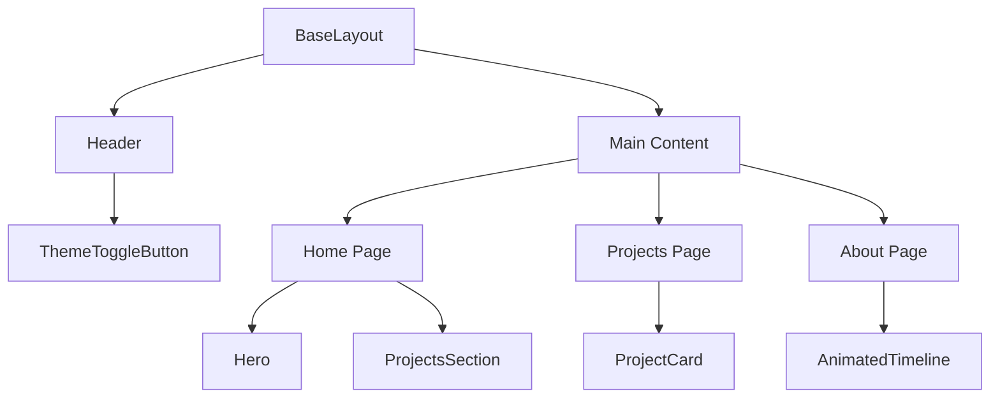

[← Home](../README.md) | [Documentation Overview](README.md) | [Architecture](ARCHITECTURE.md) | [Content Management](CONTENT_MANAGEMENT.md) | [Style Guide](STYLE_GUIDE.md)

---

# Component Reference



## Core Components

| Component | File | Description | Props |
|-----------|------|-------------|-------|
| Header | [`src/components/Header.astro`](src/components/Header.astro) | Site header with navigation and theme toggle | `navItems`, `currentPage` |
| Hero | [`src/components/Hero.astro`](src/components/Hero.astro) | Landing page hero section with animations | `headline`, `subheadline`, `ctaText`, `ctaLink` |
| BaseLayout | [`src/layouts/BaseLayout.astro`](src/layouts/BaseLayout.astro) | Base layout for all pages | `title`, `description` |
| Button | [`src/components/Button.astro`](src/components/Button.astro) | Reusable button component | `href`, `variant`, `extraClass` |
| About | [`src/components/About.astro`](src/components/About.astro) | Displays "About Me" section with profile and skills | None |
| ContactForm | [`src/components/ContactForm.astro`](src/components/ContactForm.astro) | Renders contact form with Netlify handling | None |
| ProjectsSection | [`src/components/ProjectsSection.astro`](src/components/ProjectsSection.astro) | Displays grid of featured projects | None |
| AnimatedTimeline | [`src/components/AnimatedTimeline.jsx`](src/components/AnimatedTimeline.jsx) | Creates animated vertical/horizontal timeline | `items`, `layout`, `alternating`, `lineColor`, `accentColor` |

## Page Components

| Component | File | Description |
|-----------|------|-------------|
| Home Page | [`src/pages/index.astro`](src/pages/index.astro) | Main portfolio landing page |
| About Page | [`src/pages/about.astro`](src/pages/about.astro) | About me section |
| Projects Page | [`src/pages/projects.astro`](src/pages/projects.astro) | Projects showcase |

## Utility Components

| Component | File | Description |
|-----------|------|-------------|
| AnimatedStatsCounter | [`src/components/AnimatedStatsCounter.jsx`](src/components/AnimatedStatsCounter.jsx) | Animated statistics counter |
| ParticleBackground | [`src/components/ParticleBackground.jsx`](src/components/ParticleBackground.jsx) | Interactive particle background |
| SectionDivider | [`src/components/SectionDivider.jsx`](src/components/SectionDivider.jsx) | Decorative section dividers |

## Example Usage

### Header Component
```astro
---
import Header from '../components/Header.astro';
---
<Header />
```

### Hero Component
```astro
---
import Hero from '../components/Hero.astro';

const heroData = {
  headline: "Building Digital Experiences",
  subheadline: "Creating modern web applications",
};
---
<Hero {...heroData} />
```

### Button Component
```astro
---
import Button from '../components/Button.astro';
---
<Button href="/contact" variant="primary">Contact Me</Button>
```

### About Component
```astro
---
import About from '../components/About.astro';
---
<About />
```

### ContactForm Component
```astro
---
import ContactForm from '../components/ContactForm.astro';
---
<ContactForm />
```

### ProjectsSection Component
```astro
---
import ProjectsSection from '../components/ProjectsSection.astro';
---
<ProjectsSection />
```

### AnimatedTimeline Component
```jsx
import AnimatedTimeline from '../components/AnimatedTimeline.jsx';

const timelineItems = [
  { title: 'Event 1', date: '2020', description: 'Description 1' },
  { title: 'Event 2', date: '2021', description: 'Description 2' },
];

// In your component render
<AnimatedTimeline items={timelineItems} layout="vertical" />
```

---

> **Related Documentation**
> - [Project Architecture](ARCHITECTURE.md)
> - [Content Management](CONTENT_MANAGEMENT.md)