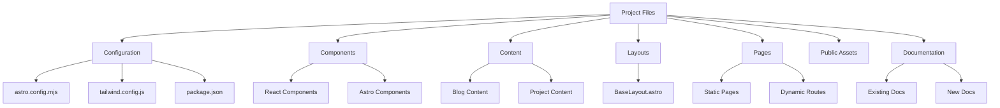
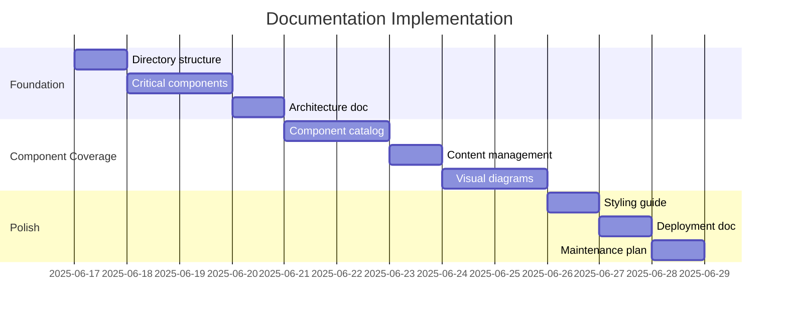

# Personal Portfolio Documentation Plan

## 1. File Analysis & Documentation Strategy


## 2. Inline Documentation Priorities
### Critical Components (P0)
- [`BaseLayout.astro`](src/layouts/BaseLayout.astro): Theme system, view transitions
- [`ProjectCard3D.jsx`](src/components/ProjectCard3D.jsx): 3D animation logic, prop definitions
- [`ContactForm.jsx`](src/components/ContactForm.jsx): Validation logic, state management
- [`Header.astro`](src/components/Header.astro): Mobile menu logic, scroll behavior

### Medium Priority (P1)
- [`AnimatedSkillBars.jsx`](src/components/AnimatedSkillBars.jsx): Animation mechanics
- [`ThemeToggleButton.astro`](src/components/ThemeToggleButton.astro): Theme persistence
- API routes ([`contact.ts`](src/pages/api/contact.ts))

### Low Priority (P2)
- Static components with minimal logic
- Configuration files with clear options

## 3. Documentation Structure
```
documentation/
├── ARCHITECTURE.md
├── COMPONENTS.md
├── STYLING_GUIDE.md
├── CONTENT_MANAGEMENT.md
├── DEPLOYMENT.md
└── images/
    └── diagrams/
```

### File Outlines
**ARCHITECTURE.md**:
```markdown
## System Overview
- Islands architecture pattern
- Data flow diagram

## Project Structure
- Directory breakdown with purposes

## Key Technologies
- Astro, React, Tailwind integration
```

**COMPONENTS.md**:
```markdown
## Component Catalog
| Component | Type | Props | Description |
|-----------|------|-------|-------------|
| BaseLayout | Astro | title, description | Main layout wrapper |
| ProjectCard3D | React | title, description, tags | 3D animated project card |
| ... | ... | ... | ... |

## Interaction Patterns
- State management approaches
- Component communication
```

**STYLING_GUIDE.md**:
```markdown
## Design System
- Color palette variables
- Typography scale

## Theming Implementation
- CSS variable structure
- Dark/light mode switching
```

## 4. Visual Design Guidelines
- **Color Scheme**: 
  - Primary: #3B82F6 
  - Secondary: #10B981
- **Typography**: 
  - Headings: Satoshi Bold 
  - Body: Inter Regular
- **Diagrams**:
  - Mermaid for architecture flows
  - Component relationship diagrams
- **Code Blocks**:
  ```tsx
  // Use syntax highlighting with language tags
  const example = "With line numbers";
  ```
- **Consistency Standards**:
  - All headers use Title Case
  - Code samples show filename context
  - Diagrams updated with component changes

## 5. Implementation Roadmap

### Phase 1: Foundation (Priority 1)
1. Create documentation directory structure
2. Add inline comments to critical components
3. Build ARCHITECTURE.md with system overview

### Phase 2: Component Coverage (Priority 1)
1. Complete COMPONENTS.md catalog
2. Document content management patterns
3. Add visual diagrams for key flows

### Phase 3: Polish & Maintenance (Priority 2)
1. Create STYLING_GUIDE.md
2. Add DEPLOYMENT.md with Vercel config
3. Establish doc update workflow

### Timeline


## Next Steps
1. Review and approve this documentation plan
2. Switch to Code mode to implement Phase 1 tasks
3. Schedule weekly documentation reviews