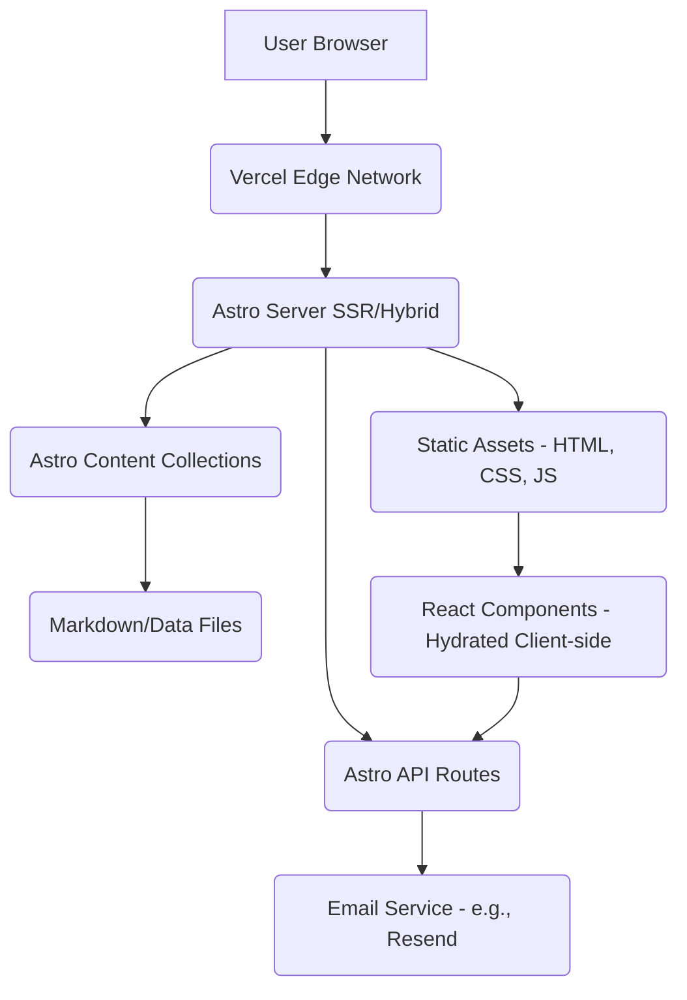

# Personal Portfolio Project - Dynamic Features Plan

This document outlines the plan for adding dynamic features to the personal portfolio website, building upon the initial static structure.

**I. Project Vision & Goals (Revised)**

*   **1.1. Overall Purpose:** To create an advanced, interactive personal portfolio website that effectively showcases full-stack skills, allows for interactive exploration of projects, potentially includes a professional blog platform, and serves as a tool for lead generation (via the contact form).
*   **1.2. Target Audience:** Primarily aimed at recruiters, potential freelance clients, and peers in the tech community.
*   **1.3. Key Objectives Checklist:**
    *   [ ] Implement a fully functional contact form that sends emails.
    *   [ ] Develop a blog section with the ability to add and display new posts.
    *   [ ] Implement interactive filtering and sorting for projects on the projects page.
    *   [ ] Integrate dynamic visualizations (graphs/dashboards) on project pages.
    *   [ ] Incorporate small game-like elements or interactive demos.
    *   [ ] Ensure core pages display dynamic content where planned (e.g., recent blog posts on homepage).
    *   [ ] Configure the project for deployment on Vercel with support for server-side functions.

**II. Technology Stack & Architecture Decisions**

*   **2.1. Astro Configuration:**
    *   Output Mode: (Static / **Server** / Hybrid) - Configured for 'server' output to enable hybrid rendering. Individual pages will use `export const prerender = true` for static generation where appropriate for performance.
    *   Integrations: (React integrated for complex interactive components and animations.) - React will be used for building interactive UI components that require client-side JavaScript.
*   **2.2. Styling:** (Tailwind CSS will be integrated for utility-first styling.) - Tailwind will be used alongside existing global CSS for efficient and consistent styling, supporting the graphical and visually appealing design goals.
*   **2.3. **Backend Logic:** (Astro API Routes) - Chosen for integrating backend logic directly within the Astro project, suitable for tasks like handling form submissions.
    *   API Route Organization: API routes will be organized within the `src/pages/api/` directory, likely grouped by feature (e.g., `src/pages/api/contact.ts`).
*   **2.4. Data Storage:** (Astro Content Collections) - Chosen for managing content like blog posts and project details due to its ease of use and integration with Astro.
    *   Blog Content: Managed via Astro Content Collections (e.g., Markdown files in `src/content/blog/`).
    *   Project Data (for filtering/sorting): Managed via Astro Content Collections (e.g., Markdown or data files in `src/content/projects/`).
    *   Contact Form Submissions: Will be processed via backend logic (Astro API Route) and sent using an email service; submissions themselves will not be stored in a database initially unless a specific requirement arises.
*   **2.5. Interactive Elements Libraries:** (Identify potential libraries for Graphs/Dashboards, Games - e.g., D3.js, Chart.js, Leaflet, Phaser.js)
    *   Note: Specific library choices are deferred until Section III implementation details. Anticipated categories include Charting/Visualization (e.g., Chart.js, D3.js) and potentially Game Development (e.g., Phaser.js, PixiJS). These will likely be integrated within React components.
*   **2.6. Hosting Platform:** (Vercel) - Chosen for its support for Astro SSR/Hybrid and ease of use, including seamless Git integration and environment variable management.

**Architecture Diagram (Conceptual):**



**III. Feature Implementation Details**

*   **3.1. Contact Form:**
    *   Frontend: Implement a form on the contact page (`src/pages/contact.astro`) with fields for Name, Email, Subject, and Message. Implement client-side validation to ensure all fields are required and the Email field has a valid format. Use Tailwind CSS for styling.
    *   Backend: Create an Astro API Route (e.g., `src/pages/api/contact.ts`) to receive POST requests from the form. Implement server-side validation. Use a library (like `resend` or `nodemailer`) to send the email to a configured address using an email service (planned: Resend). Handle success and error responses.
*   **3.2. Blog Section:**
    *   Content Source: Set up an Astro Content Collection for blog posts (e.g., `src/content/blog/`). Define a schema for blog post frontmatter (title, date, author, tags, etc.).
    *   Pages:
        *   Main list page (`src/pages/blog/index.astro`): Fetch all blog posts from the collection, sort them (e.g., by date), and display a list with titles, dates, and excerpts. Implement pagination if the number of posts grows large.
        *   Individual post pages (`src/pages/blog/[...slug].astro`): Dynamically generate pages for each blog post using Astro's dynamic routing. Fetch the content of the specific post and display it.
        *   Category/Tag pages (`src/pages/blog/category/[category].astro`, `src/pages/blog/tag/[tag].astro`): Dynamically generate pages listing posts filtered by category or tag.
    *   Rendering: Use Astro's built-in content collection features to query and render blog post data and content.
*   **3.3. Project Filtering/Sorting:**
    *   Data Source: Project details will be stored in an Astro Content Collection (e.g., `src/content/projects/`). Include frontmatter for technology used, project type, skills demonstrated, and date.
    *   Filtering Logic: Implement client-side JavaScript (potentially within a React component) to filter the displayed projects based on selected criteria (technology, type, skills).
    *   Sorting Logic: Implement client-side JavaScript to sort the displayed projects by Date (Newest First) and Alphabetical order based on project title.
    *   UI: Add checkboxes for filtering criteria and a dropdown menu for sorting options on the projects page (`src/pages/projects.astro`). Use Tailwind CSS for styling.
*   **3.4. Interactive Visualizations (Graphs/Dashboards):**
    *   Location: Primarily on individual project pages (`src/pages/projects/[...slug].astro`).
    *   Structure:
        *   Common Dashboard Section: Implement a reusable component (likely React) to display summary data near the top of project pages (e.g., Technology Stack Breakdown, Project Duration/Timeline). Data will be sourced from project Content Collection frontmatter.
        *   Project-Specific Visualizations Section: Implement a flexible area below the main project description to embed visualizations unique to that project (e.g., architecture diagrams, performance charts). Implementation will vary per project.
    *   Visualization Types & Libraries: Specific choices deferred until implementation phase for each visualization. Will integrate chosen libraries (e.g., Charting/Visualization, Game Development) within React components as needed.
*   **3.5. Games/Interactive Demos:**
    *   Scope:
        *   Interactive Demos for Specific Projects: Showcase functionality/concepts of individual projects.
        *   Small Game-Like Elements: Simpler, engaging elements on relevant pages for visual appeal/fun.
    *   Technology:
        *   Simpler Demos/Elements: React components leveraging standard browser APIs (Canvas, SVG), CSS/JS animations, Tailwind styling.
        *   Complex Demos/Games: Consider integrating a dedicated JavaScript game library (e.g., Phaser.js, PixiJS). Specific library choice deferred until implementation.
    *   Integration: Preferred method is to embed directly within relevant project or site pages using React components (Astro Islands) for a seamless user experience.

*   **3.6. Core Pages (About, Resume, etc.):**
    *   Homepage (`index.astro`):
        *   Dynamically fetch and display recent blog posts (e.g., latest 3) from the blog content collection.
        *   Present posts as visually appealing cards (including featured image/excerpt if available) with potential hover effects, using React components and Tailwind styling.
    *   Resume/Skills Page (`resume.astro`):
        *   Embed dynamic skill visualizations (specific type TBD during implementation, likely a chart or interactive tag cloud) using a React component.
        *   Include a link for Dynamic PDF Download (mechanism to ensure latest version TBD, potentially involving a build step or serverless function).
    *   Footer (in `BaseLayout.astro`):
        *   Implement a Dynamic Copyright Year using JavaScript.
        *   Display a "Site Last Updated" timestamp (potentially using Vercel deployment environment variables).
    *   Note: Other brainstormed ideas (dynamic project spotlight, interactive timelines/maps, etc.) are deferred for potential future enhancement phases.

**IV. Development & Documentation Workflow**

*   **4.1. Git Branching Strategy:** (Simple feature branch workflow - create a new branch for each feature/fix.) - Work on each dynamic feature or bug fix in a dedicated branch, merging into the main development branch upon completion and review.
*   **4.2. Task Breakdown:** (Tasks will be managed using markdown files with checklists in a `To Do` subdirectory within `personal-portfolio/documentation/dev_docs/`.) - Create specific task lists for each major feature implementation.
*   **4.3. Documentation Updates:** (Strictly follow the general rule: keep documentation synchronized with code changes and proactively create new documentation files as needed for architecture, API routes, CMS setup, etc.) - Ensure all new components, API routes, data structures, and architectural decisions are documented concurrently with development.
*   **4.4. Environment Variables:** (Standard approach: .env file locally, Vercel settings for deployment.) - Manage sensitive keys and configuration using environment variables, keeping them out of the codebase.

**V. Deployment Strategy (Revised)**

This section outlines the key steps and considerations for deploying the dynamic Astro portfolio website to Vercel.

*   **5.1. Chosen Platform Setup (Vercel):**
    *   Account: Create a Vercel account using GitHub, GitLab, or email if one doesn't already exist.
    *   Project Creation: Create a new project on the Vercel dashboard.
    *   Git Repository Linking: Connect the Vercel project directly to the GitHub repository containing the personal-portfolio code. This enables automatic deployments on pushes to the main branch (or specified branches).
    *   Root Directory: Ensure Vercel correctly identifies the root directory within the repository where the personal-portfolio code resides (if it's not at the top level).

*   **5.2. Build & Deployment Configuration (Astro Hybrid on Vercel):**
    *   Astro Vercel Adapter: Ensure the `@astrojs/vercel` adapter is installed as a development dependency (`npm install --save-dev @astrojs/vercel` or `npx astro add vercel`). This adapter configures Astro's output specifically for Vercel's build and serverless/edge function environment.
    *   `astro.config.mjs`: Verify the configuration file correctly includes `output: 'server'` and imports/configures the `@astrojs/vercel` adapter.
    *   Vercel Build Settings:
        *   Framework Preset: Vercel should automatically detect "Astro" and apply appropriate default settings.
        *   Build Command: Verify it defaults to `npm run build` or the correct script from `package.json`. Usually no override needed.
        *   Output Directory: Vercel's build output setting can often be left default when using the adapter, as the adapter handles directing static vs. serverless output correctly. Astro's `dist/` folder contains static assets, but Vercel's functions handle dynamic routes.
        *   Install Command: Verify it defaults to `npm install` or `yarn install` / `pnpm install` as appropriate.
        *   Node.js Version: Ensure the Node.js version selected in Vercel project settings is compatible with the version required by Astro and the `@astrojs/vercel` adapter (check their respective documentations, but typically Node 18.x or later).

*   **5.3. Environment Variable Management in Hosting (Vercel):**
    *   Identification: Identify all required environment variables needed for production (e.g., `RESEND_API_KEY` for the contact form email service).
    *   Configuration: Add these variables securely through the Vercel project dashboard under Settings -> Environment Variables.
    *   Scope: Assign variables to the appropriate environments (Production, Preview, Development). Ensure sensitive keys are only exposed to Production/Preview as needed, not Development unless necessary for specific Vercel dev workflows.
    *   Access: Remind developers that server-side code (API Routes, server-rendered pages) accesses these via `import.meta.env.VARIABLE_NAME`. Ensure no secrets are exposed client-side.

*   **5.4. Custom Domain (If Applicable):**
    *   Purchase/Transfer: Ensure the desired custom domain is available and registered.
    *   Vercel Configuration: Add the custom domain(s) (e.g., `yourdomain.com` and `www.yourdomain.com`) to the Vercel project under Settings -> Domains.
    *   DNS Configuration: Follow Vercel's instructions to update the DNS records (usually adding A or CNAME records) at the domain registrar (e.g., GoDaddy, Namecheap, Cloudflare DNS).
    *   Propagation & SSL: Allow time for DNS changes to propagate globally. Vercel will automatically provision and renew SSL certificates for the configured domains.

**Deployment Pipeline Diagram (Conceptual):**

```mermaid
graph TD
    A[Git Push] --> B(Vercel Build Process);
    B --> C{Astro Build};
    C --> D(Static Assets);
    C --> E(Serverless Functions);
    D --> F(Vercel CDN);
    E --> F;
    F --> G[User Request];