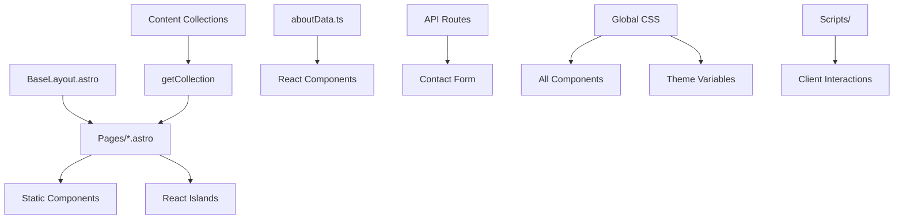

# Iftekhar's Personal Portfolio - Source Code Architecture Guide

## Table of Contents
1. [Overview](#overview)
2. [Project Structure](#project-structure)
3. [Architecture Patterns](#architecture-patterns)
4. [Component Interactions](#component-interactions)
5. [Pages Deep Dive](#pages-deep-dive)
6. [Components Deep Dive](#components-deep-dive)
7. [Data Flow & State Management](#data-flow--state-management)
8. [Styling & Theming](#styling--theming)
9. [Content Management](#content-management)
10. [Performance & Optimization](#performance--optimization)
11. [Development Workflow](#development-workflow)

---

## Overview

This Astro-based personal portfolio leverages a hybrid architecture combining:
- **Astro** for static site generation and server-side rendering
- **React** for interactive components
- **Tailwind CSS** for styling
- **Content Collections** for data management
- **Vercel** for deployment and API routes

### Key Technologies
- **Framework**: Astro 5.7.5 with server output
- **UI Library**: React 19.1.0 for interactive components
- **Styling**: Tailwind CSS 3.4.17 + Custom CSS variables
- **Content**: Astro Content Collections with TypeScript schemas
- **Deployment**: Vercel with Edge Functions
- **Email**: Resend API for contact form

---

## Project Structure

```
src/
├── components/          # Reusable UI components
│   ├── *.astro         # Server-side Astro components
│   └── *.jsx           # Client-side React components
├── content/            # Content Collections
│   ├── config.ts       # Schema definitions
│   ├── blog/          # Blog posts (Markdown)
│   └── projects/      # Project data (Markdown)
├── data/              # TypeScript data files
│   └── aboutData.ts   # Skills and experience data
├── layouts/           # Page layouts
│   └── BaseLayout.astro # Main layout wrapper
├── pages/             # File-based routing
│   ├── *.astro        # Static pages
│   ├── api/           # API endpoints
│   └── blog/          # Dynamic blog routes
├── scripts/           # Client-side JavaScript
├── styles/            # Global CSS and themes
└── types/             # TypeScript type definitions
```

---

## Architecture Patterns

### 1. Islands Architecture
Astro's islands architecture is implemented throughout:

**Static Components (Astro):**
- `BaseLayout.astro` - Base HTML structure
- `Hero.astro` - Landing page hero
- `About.astro` - About section
- `ProjectCard.astro` - Static project cards

**Interactive Islands (React):**
- `ContactForm.jsx` - Form with validation
- `ProjectFilterSort.jsx` - Project filtering/sorting
- `ParticleBackground.jsx` - Animated background
- `SkillRadarChart.jsx` - Interactive chart

### 2. Hydration Strategy
Components use specific client directives:

```astro
<!-- Load immediately -->
<ParticleBackground client:load />

<!-- Load when visible -->
<SkillRadarChart client:visible />

<!-- Load when idle -->
<ContactForm client:idle />
```

### 3. Content-First Approach
Content is managed through Astro Content Collections:

```typescript
// src/content/config.ts
const projectsCollection = defineCollection({
  type: 'content',
  schema: z.object({
    title: z.string(),
    description: z.string(),
    technologies: z.array(z.string()),
    featured: z.boolean().optional(),
  }),
});
```

---

## Component Interactions

### Data Flow Diagram



### Component Hierarchy

1. **BaseLayout.astro** (Root Layout)
   - Provides HTML structure
   - Imports global styles
   - Manages theme system
   - Includes navigation and footer

2. **Page Components** (src/pages/)
   - Compose layout with sections
   - Fetch data from collections
   - Pass props to child components

3. **Section Components** (Layout building blocks)
   - `Hero.astro` - Landing hero section
   - `About.astro` - About me section
   - `ProjectsSection.astro` - Projects overview

4. **Interactive Components** (React)
   - Handle user interactions
   - Manage local state
   - Provide dynamic functionality

---

## Pages Deep Dive

### 1. index.astro (Homepage)
**Purpose**: Main landing page with hero, about, projects, and contact sections

**Key Imports**:
```astro
import BaseLayout from '../layouts/BaseLayout.astro';
import Hero from '../components/Hero.astro';
import About from '../components/About.astro';
import ProjectsSection from '../components/ProjectsSection.astro';
import ContactForm from '../components/ContactForm.jsx';
import ParticleBackground from '../components/ParticleBackground.jsx';
```

**Data Flow**:
- Defines `heroData` object with headline/subheadline
- Creates `stats` array for AnimatedStatsCounter
- Passes data to child components via props

**Component Composition**:
```astro
<BaseLayout>
  <ParticleBackground client:load />
  <Hero {...heroData} />
  <SectionDivider />
  <AnimatedStatsCounter client:visible />
  <About />
  <ProjectsSection />
  <ContactForm client:visible />
</BaseLayout>
```

### 2. about.astro
**Purpose**: Detailed about page with skills visualization and timeline

**Key Features**:
- Imports data from `../data/aboutData.ts`
- Uses React components for interactive elements
- Implements section dividers for visual separation

**Data Integration**:
```astro
import { skillsData, experienceData } from '../data/aboutData';

<SkillRadarChart client:visible skills={skillsData} />
<AnimatedTimeline client:visible items={experienceData} />
```

### 3. projects.astro
**Purpose**: Project showcase with filtering and 3D cards

**Content Collection Usage**:
```astro
const allProjects = await getCollection('projects');
const featuredProjects = allProjects.filter(project => project.data.featured);
```

**Dynamic Rendering**:
- Featured projects use `ProjectCard3D.jsx`
- All projects use `ProjectFilterSort.jsx` for interaction

### 4. contact.astro
**Purpose**: Dedicated contact page with enhanced form

**Enhanced Features**:
- Particle background for visual appeal
- Gradient headers
- Full-page ContactForm component

### 5. API Route: api/contact.ts
**Purpose**: Server-side contact form processing

**Implementation**:
```typescript
export const POST: APIRoute = async ({ request }) => {
  const data = await request.formData();
  // Validation and email sending via Resend API
};
```

---

## Components Deep Dive

### Astro Components (.astro)

#### BaseLayout.astro
**Role**: Core layout wrapper for all pages

**Key Features**:
- HTML document structure
- Theme management system
- Navigation header
- Global scripts and styles
- ViewTransitions for page animations

**Theme System**:
```javascript
// Inline script for immediate theme application
const theme = (() => {
  const storedPref = localStorage.getItem('theme-preference');
  if (typeof storedPref === 'string') return storedPref;
  const mediaQuery = window.matchMedia('(prefers-color-scheme: dark)');
  return mediaQuery.matches ? 'dark' : 'light';
})();
document.documentElement.setAttribute('data-theme', theme);
```

#### Hero.astro
**Role**: Landing page hero section

**Props Interface**:
```typescript
export interface Props {
  headline: string;
  subheadline: string;
  ctaText?: string;
  ctaLink?: string;
  imageUrl?: string;
  imageAlt?: string;
}
```

**Features**:
- Animated gradient text
- Typewriter effect
- Floating decorative elements
- Responsive design

#### ProjectCard.astro
**Role**: Static project card display

**Props**:
- Project metadata (title, description, image)
- Technology tags
- Demo and code URLs

**Styling**:
- Hover animations
- Image overlays
- Technology tag pills

### React Components (.jsx)

#### ContactForm.jsx
**Role**: Interactive contact form with validation

**State Management**:
```jsx
const [formData, setFormData] = useState({
  name: '', email: '', subject: '', message: ''
});
const [formState, setFormState] = useState({
  isSubmitting: false, isSubmitted: false, isError: false
});
```

**Features**:
- Real-time validation
- Visual feedback states
- API integration with /api/contact
- Accessibility features

#### ProjectFilterSort.jsx
**Role**: Dynamic project filtering and sorting

**Functionality**:
- Category-based filtering
- Technology tag filtering
- Sort by date, name, or featured status
- Search functionality
- Responsive grid layout

#### ParticleBackground.jsx
**Role**: Animated particle system

**Configuration**:
```jsx
<ParticleBackground 
  color="59, 130, 246" 
  particleDensity={8}
  mouseInteract={true}
  maxConnectDistance={150}
/>
```

#### SkillRadarChart.jsx
**Role**: Interactive skills visualization

**Data Integration**:
- Consumes `skillsData` from aboutData.ts
- Charts.js integration
- Responsive canvas rendering

#### ProjectCard3D.jsx
**Role**: 3D animated project cards

**Enhanced Features**:
- Tilt3D wrapper component
- Hover animations
- Featured project highlighting
- Interactive buttons

#### Tilt3D.jsx
**Role**: 3D tilt effect wrapper

**Implementation**:
```jsx
const handleMouseMove = (e) => {
  const { left, top, width, height } = rect;
  const x = (e.clientX - left) / width;
  const y = (e.clientY - top) / height;
  
  const rotateY = (x - 0.5) * maxTilt;
  const rotateX = (0.5 - y) * maxTilt;
  
  setStyle({
    transform: `perspective(${perspective}px) rotateX(${rotateX}deg) rotateY(${rotateY}deg) scale3d(${scale}, ${scale}, ${scale})`
  });
};
```

---

## Data Flow & State Management

### Content Collections Flow
1. **Schema Definition** (`src/content/config.ts`)
2. **Content Files** (`src/content/projects/*.md`)
3. **Collection Fetching** (`getCollection('projects')`)
4. **Component Rendering** (Props passed to components)

### State Management Patterns

#### Local State (React Components)
```jsx
// ContactForm.jsx
const [formData, setFormData] = useState({...});
const [isSubmitting, setIsSubmitting] = useState(false);
```

#### Global State (CSS Variables + localStorage)
```css
:root {
  --clr-primary: #3B82F6;
  --clr-secondary: #10B981;
}

[data-theme="dark"] {
  --clr-text-current: var(--clr-text-dark);
  --clr-bg-current: var(--clr-bg-dark);
}
```

#### API State (Server Communication)
```typescript
// API route handling
export const POST: APIRoute = async ({ request }) => {
  // Form processing and email sending
};
```

---

## Styling & Theming

### CSS Architecture

#### 1. Global Styles (`src/styles/global.css`)
```css
@tailwind base;
@tailwind components;
@tailwind utilities;

/* CSS Custom Properties for theming */
:root {
  --clr-primary: #3B82F6;
  --clr-secondary: #10B981;
  --clr-text-current: var(--clr-text-light);
}
```

#### 2. Component Styles
- Astro components use `<style>` blocks
- React components use Tailwind classes
- Scoped styles prevent conflicts

#### 3. Theme System
**Theme Variables**:
- Light/dark mode CSS custom properties
- Consistent color palette
- Typography scale
- Responsive design tokens

**Theme Switching**:
```javascript
// theme-toggle.js
const setTheme = (theme) => {
  document.documentElement.setAttribute('data-theme', theme);
  localStorage.setItem('theme-preference', theme);
};
```

### Design System

#### Colors
- **Primary**: #3B82F6 (Blue)
- **Secondary**: #10B981 (Green)
- **Accent**: #F59E0B (Orange)

#### Typography
- **Primary Font**: Poppins (sans-serif)
- **Secondary Font**: Merriweather (serif)
- **Scale**: 1.25 ratio for consistent sizing

#### Components
- **Buttons**: `.btn`, `.btn-primary`, `.btn-outline`
- **Cards**: `.card` with hover effects
- **Tags**: `.tag`, `.tag-primary`, `.tag-secondary`

---

## Content Management

### Content Collections Schema

#### Projects Collection
```typescript
const projectsCollection = defineCollection({
  type: 'content',
  schema: z.object({
    title: z.string(),
    description: z.string(),
    technologies: z.array(z.string()),
    tags: z.array(z.string()).optional(),
    image: z.string().optional(),
    demoUrl: z.string().url().optional(),
    codeUrl: z.string().url().optional(),
    featured: z.boolean().optional(),
    type: z.string(),
  }),
});
```

#### Blog Collection
```typescript
const blogCollection = defineCollection({
  type: 'content',
  schema: z.object({
    title: z.string(),
    date: z.date(),
    description: z.string(),
  }),
});
```

### Data Sources

#### Static Data (`src/data/aboutData.ts`)
```typescript
export interface Skill {
  name: string;
  level: number;
}

export const skillsData: Skill[] = [
  { name: "JavaScript", level: 90 },
  { name: "React", level: 85 },
  // ...
];
```

#### Dynamic Content (Markdown files)
- Project descriptions and metadata
- Blog posts with frontmatter
- Automatic slug generation

---

## Performance & Optimization

### Astro Optimizations
1. **Static Generation**: Pages pre-rendered at build time
2. **Partial Hydration**: Only interactive components load JavaScript
3. **Code Splitting**: Components loaded on demand
4. **Image Optimization**: Built-in image processing

### Client Directives Strategy
```astro
<!-- Critical, load immediately -->
<ParticleBackground client:load />

<!-- Below fold, load when visible -->
<SkillRadarChart client:visible />

<!-- Non-critical, load when browser idle -->
<ContactForm client:idle />
```

### Bundle Optimization
- **Tree Shaking**: Unused code eliminated
- **Component Splitting**: React components bundled separately
- **CSS Purging**: Tailwind removes unused styles

### Loading Strategies
```astro
<!-- Font preloading -->
<link rel="preconnect" href="https://fonts.googleapis.com">
<link rel="preload" href="/fonts/main.woff2" as="font">

<!-- Image lazy loading -->

```

---

## Development Workflow

### File Organization Principles
1. **Separation of Concerns**: Astro for structure, React for interaction
2. **Component Reusability**: Shared components in `/components`
3. **Type Safety**: TypeScript interfaces and schemas
4. **Content Separation**: Markdown files for dynamic content

### Development Patterns

#### Component Creation Pattern
```astro
---
// Props interface
interface Props {
  title: string;
  optional?: boolean;
}

// Data fetching (if needed)
const data = await getCollection('...');

// Component logic
const { title, optional = false } = Astro.props;
---

<!-- Template -->
<section class="component-class">
  <h2>{title}</h2>
  <!-- Content -->
</section>

<style>
  /* Scoped styles */
  .component-class { /* styles */ }
</style>
```

#### React Component Pattern
```jsx
import { useState, useEffect } from 'react';

const ComponentName = ({ prop1, prop2 }) => {
  const [state, setState] = useState(initialValue);
  
  const handleInteraction = () => {
    // Logic
  };
  
  return (
    <div className="tailwind-classes">
      {/* JSX content */}
    </div>
  );
};

export default ComponentName;
```

### Build Process
1. **Content Processing**: Markdown → HTML
2. **Component Compilation**: Astro + React → Static HTML + JS islands
3. **Style Processing**: Tailwind + CSS → Optimized CSS
4. **Asset Optimization**: Images, fonts, scripts
5. **Static Generation**: Pre-rendered pages
6. **Deployment**: Vercel Edge Functions

### Key Commands
```bash
# Development
npm run dev

# Production build
npm run build

# Preview build
npm run preview

# Type checking
npm run astro check
```

---

## Conclusion

This architecture provides:
- **Performance**: Static generation with selective hydration
- **Developer Experience**: Type safety and hot reloading
- **User Experience**: Fast loading and smooth interactions
- **Maintainability**: Clear separation of concerns
- **Scalability**: Modular component system

The combination of Astro's static generation with React's interactivity creates an optimal balance between performance and functionality, making this portfolio both fast and engaging.
