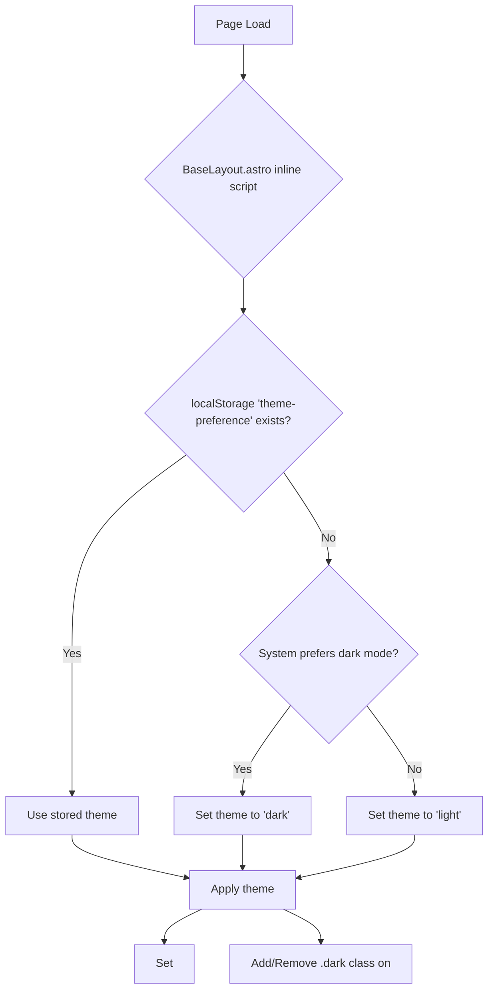

# Theme System Review Report

## 1. Introduction

This report reviews the day/night mode (theme) system implemented in the Iftekhar Personal Portfolio project. It covers the initial theme detection, theme switching mechanism, styling approach, and specifically analyzes the `Hero.astro` component's interaction with the theme system. The goal is to identify reasons for any lack of smoothness or perceived inconsistencies in the theme application.

## 2. Current Theme System Implementation

The theme system is primarily managed through a combination of an inline script in `src/layouts/BaseLayout.astro`, a deferred JavaScript file (`public/scripts/theme-toggle.js`), CSS custom properties defined in `src/styles/global.css`, and Tailwind CSS's `dark:` variant functionality.

### 2.1. Initial Theme Detection and Application

-   **Location:** Inline `<script>` in `src/layouts/BaseLayout.astro`.
-   **Process:**
    1.  Checks `localStorage` for a previously stored `theme-preference`.
    2.  If no preference is found in `localStorage` (or `localStorage` is inaccessible), it falls back to the user's operating system preference via `window.matchMedia('(prefers-color-scheme: dark)')`.
    3.  The determined theme (`'light'` or `'dark'`) is then applied by:
        *   Setting the `data-theme` attribute on the `<html>` element (e.g., `data-theme="dark"`).
        *   Adding the `dark` class to the `<html>` element if the theme is dark. This class is used by Tailwind CSS for its `dark:` variants.

### 2.2. Theme Switching Mechanism

-   **Components Involved:**
    *   `src/components/ThemeToggleButton.astro`: An Astro component that renders the clickable button for toggling the theme.
    *   `public/scripts/theme-toggle.js`: A JavaScript file (loaded with `defer`) that handles the logic for the theme toggle.
-   **Process:**
    1.  The `ThemeToggleButton` component provides the UI.
    2.  `theme-toggle.js` listens for clicks on this button.
    3.  Upon a click:
        *   It determines the current theme (again, by checking `localStorage` or system preference).
        *   It calculates the new theme (if current is `light`, new is `dark`, and vice-versa).
        *   It calls `setPreference(newTheme)`:
            *   Stores the `newTheme` in `localStorage` under the key `theme-preference`.
            *   Calls `reflectPreference(newTheme)`.
        *   `reflectPreference(newTheme)`:
            *   Updates the `data-theme` attribute on the `<html>` element.
            *   Adds or removes the `dark` class on the `<html>` element.
            *   Updates the `aria-label` of the toggle button for accessibility.

### 2.3. Styling

-   **CSS Custom Properties (`src/styles/global.css`):**
    *   Defines a base set of color variables (e.g., `--clr-primary`, `--clr-bg-base`, `--clr-text-base`).
    *   Defines theme-specific variables for light and dark modes (e.g., `--clr-text-light`, `--clr-bg-light`, `--clr-text-dark`, `--clr-bg-dark`).
    *   Uses the `data-theme` attribute on the `<html>` element to switch "current" theme variables:
        *   `html:not([data-theme="dark"])` applies light theme variables (e.g., `--clr-text-current: var(--clr-text-light);`).
        *   `[data-theme="dark"]` applies dark theme variables (e.g., `--clr-text-current: var(--clr-text-dark);`).
    *   The `body` element has a CSS transition for `background-color` and `color` to provide smooth visual changes: `transition: background-color 0.3s ease, color 0.3s ease;`.

-   **Tailwind CSS:**
    *   Configured to use `darkMode: 'class'`, meaning `dark:` variants in Tailwind classes (e.g., `dark:bg-gray-800`) are activated when the `<html>` element has the `dark` class.
    *   Components primarily use Tailwind utility classes for styling, including `dark:` variants for theme-specific adjustments.

## 3. Data Flow Diagrams

### 3.1. Initial Theme Load



### 3.2. Theme Toggle Flow

```mermaid
graph TD
    A[User clicks ThemeToggleButton] --> B{theme-toggle.js event listener};
    B --> C[Get current theme (localStorage/system)];
    C --> D[Determine new theme (light ↔ dark)];
    D --> E[setPreference(newTheme)];
    E --> F[Store newTheme in localStorage];
    E --> G[reflectPreference(newTheme)];
    G --> H[Set <html data-theme="newTheme">];
    G --> I[Add/Remove .dark class on <html>];
    G --> J[Update button ARIA label];
```

## 4. Analysis of `Hero.astro` Component

The `src/components/Hero.astro` component uses Tailwind CSS classes for its styling, including `dark:` variants.

Key styling aspects:
-   **Background:** `class="... bg-gradient-to-br from-bg-base to-bg-alt dark:from-bg-dark dark:to-bg-alt-dark ..."`
    *   This implies that `bg-base`, `bg-alt`, `bg-dark`, and `bg-alt-dark` are defined in the Tailwind configuration, likely mapping to CSS variables or specific color values.
    *   These classes should respond correctly to the `dark` class on the `<html>` element.
-   **Decorative Elements:** e.g., `bg-primary/10 dark:bg-primary/20`.
    *   This uses Tailwind's opacity shorthand with the `primary` color. If `--clr-primary` is a static color (which it is, as per `global.css`), the base color remains the same in light and dark modes, with only the opacity potentially changing if `bg-primary/20` resolves differently in dark mode (which it does, due to the `dark:` prefix).
-   **Text Colors:** e.g., `text-primary dark:text-primary`, `text-secondary dark:text-secondary`.
    *   The CSS variables `--clr-primary` and `--clr-secondary` are defined in `:root` and are not overridden by the theme-switching logic in `global.css`. This means they are static colors (Blue and Green, respectively).
    *   Therefore, text styled with `text-primary` will be blue in both light and dark modes. This is a design choice but might contribute to a feeling of a "different system" if other text elements change color more dramatically.

## 5. Identified Potential Issues & Inconsistencies

### 5.1. Smoothness of Transitions
-   The `body` element has a `transition` for `background-color` and `color`. This provides a smooth effect for the general page background and text.
-   The `Hero.astro` component's background is a CSS gradient (`bg-gradient-to-br ...`). CSS gradients are `background-image` properties. Standard CSS transitions do not smoothly animate changes to `background-image` when the underlying colors of the gradient change.
-   **This is the most likely reason for the theme change feeling "not smooth" on the Hero component.** The Hero background will likely "snap" to the new theme's colors rather than transitioning smoothly like the body background.

### 5.2. `dark` Class Management in `BaseLayout.astro`
-   The inline script in `BaseLayout.astro` adds the `dark` class if `theme === 'dark'` but does not explicitly remove it if `theme === 'light'`.
    ```javascript
    // src/layouts/BaseLayout.astro
    if (theme === 'dark') {
      document.documentElement.classList.add('dark');
    }
    // Missing: else { document.documentElement.classList.remove('dark'); }
    ```
-   While generally not an issue on initial page loads (as the class wouldn't typically be present), explicitly removing it would make the logic more robust and consistent with `theme-toggle.js`, which does explicitly remove it. This is a minor point and unlikely the cause of the main reported issue.

### 5.3. Static Accent Colors
-   Colors like `--clr-primary` and `--clr-secondary` are static and do not change with the theme. Elements using these colors (e.g., `text-primary` in `Hero.astro`) will retain their color in both light and dark modes.
-   If the expectation is for all colors to adapt, this could be perceived as part of a "different system" for the Hero component. However, this is a common design choice for branding accents.

### 5.4. Visual Discrepancy of Hero Component
-   The primary reason the Hero component might feel like it has a "different day/night system" is likely the lack of a smooth background transition, contrasting with the smoother transition of the main page background.
-   The static nature of its accent colors (`text-primary`) could also contribute if not an intentional design choice understood by the user.

## 6. Recommendations

### 6.1. Improve Hero Component Background Transition
-   To achieve a smoother background gradient transition for the Hero component, direct CSS transitions on `background-image` are not feasible. Consider these alternatives:
    1.  **Pseudo-elements with Opacity Fade:** Use two overlapping pseudo-elements (or nested divs), one styled for the light theme gradient and one for the dark theme gradient. Toggle their opacity to fade between them. This is a common technique for cross-fading backgrounds.
    2.  **Transition Individual Gradient Stop Colors (If Possible):** If the gradient colors are defined by CSS custom properties that themselves can be transitioned, this might offer a path. However, `from-bg-base` etc., are Tailwind classes. You might need to apply a custom class to the Hero section and manage its background with CSS variables that are transitioned.
        Example (conceptual):
        ```css
        /* In global.css or Hero.astro <style> */
        .hero-background {
          --hero-gradient-start: var(--clr-bg-base); /* Light theme default */
          --hero-gradient-end: var(--clr-bg-alt);   /* Light theme default */
          background-image: linear-gradient(to bottom right, var(--hero-gradient-start), var(--hero-gradient-end));
          transition: --hero-gradient-start 0.3s ease, --hero-gradient-end 0.3s ease; /* Requires Houdini Paint API or similar for direct transition of vars in gradients */
        }

        [data-theme="dark"] .hero-background {
          --hero-gradient-start: var(--clr-bg-dark);
          --hero-gradient-end: var(--clr-bg-alt-dark);
        }
        ```
        *Note: Transitioning CSS custom properties used directly in `background-image` like this is not universally supported without Houdini. The pseudo-element approach is more robust.*

### 6.2. Refine `BaseLayout.astro` Inline Script
-   For consistency and robustness, modify the inline script in `BaseLayout.astro` to explicitly remove the `dark` class when the light theme is active:
    ```html
    <script is:inline>
      // ... (getInitialTheme function)
      const theme = getInitialTheme();
      document.documentElement.setAttribute('data-theme', theme);
      if (theme === 'dark') {
        document.documentElement.classList.add('dark');
      } else {
        document.documentElement.classList.remove('dark'); // Add this line
      }
    </script>
    ```

### 6.3. Review Accent Color Strategy (Optional)
-   If the static nature of accent colors like `text-primary` in dark mode is undesirable, consider defining themed versions of these colors:
    ```css
    /* In global.css */
    :root {
      --clr-primary-light: #3B82F6;
      --clr-primary-dark: #60A5FA; /* Example: a lighter blue for dark mode */
      /* ... other colors ... */
    }

    html:not([data-theme="dark"]) {
      --clr-primary-current: var(--clr-primary-light);
      /* ... */
    }

    [data-theme="dark"] {
      --clr-primary-current: var(--clr-primary-dark);
      /* ... */
    }
    ```
    Then, update Tailwind configuration or use classes that apply `var(--clr-primary-current)`. This would make accent colors adapt to the theme.

### 6.4. Verify Tailwind Configuration
-   Ensure that `tailwind.config.js` correctly defines colors like `bg-base`, `bg-alt`, `bg-dark`, `bg-alt-dark` and that they map to the intended CSS variables or color values for both light and dark themes, aligning with the variables in `global.css`.

By addressing the gradient transition on the Hero component, the perceived smoothness and consistency of the day/night mode system should significantly improve.
