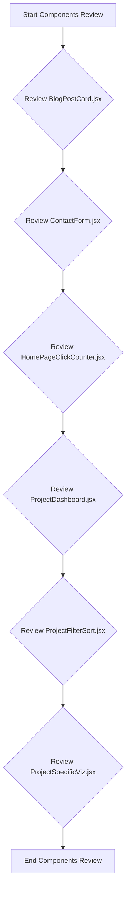
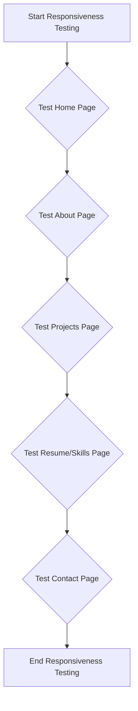
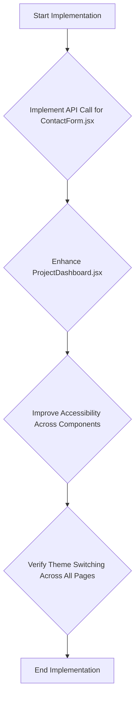

# Critique Plan for Personal Portfolio Project

## Overview
This document outlines a comprehensive plan for critiquing the existing visual implementation of the personal portfolio project and suggesting improvements. The critique will cover components, responsiveness, and theme switching functionality.

## Components Review
### Component Analysis Flowchart

### BlogPostCard.jsx
- Uses Tailwind CSS for styling.
- Displays blog post title, date, and description.
- Suggestions: Ensure consistency with global styles, verify accessibility.

### ContactForm.jsx
- Manages form state and validation using React hooks.
- Includes client-side validation for form fields.
- Styled with Tailwind CSS.
- Suggestions: Implement API call for form submission, ensure accessibility.

### HomePageClickCounter.jsx
- Uses React state to manage click count.
- Styled with Tailwind CSS.
- Provides a simple interactive experience.
- Suggestions: Verify accessibility and consistency with global styles.

### ProjectDashboard.jsx
- Intended to display project summary data.
- Currently not fully implemented.
- Suggestions: Complete implementation, use Tailwind CSS for styling.

### ProjectFilterSort.jsx
- Handles filtering and sorting of projects.
- Uses React state and effect hooks for logic.
- Styled with Tailwind CSS.
- Suggestions: Verify accessibility, ensure clear labeling of filter and sort options.

### ProjectSpecificViz.jsx
- Displays project-specific visualization data.
- Currently basic implementation.
- Suggestions: Enhance styling, ensure data is correctly formatted.

## Responsiveness and Theme Switching
### Responsiveness Testing Flowchart

- Initial view appears responsive.
- Theme switching functionality is available.
- Suggestions: Verify theme switching across all pages, enhance content.

## Comprehensive Report
- Summarize findings from component reviews and responsiveness testing.
- Provide actionable suggestions for improving the visual implementation and user experience.

## Implementation Roadmap
### Roadmap for Improvements

## Next Steps
1. Review the updated critique plan.
2. Switch to Orchestrator mode to start the implementation of the plan.