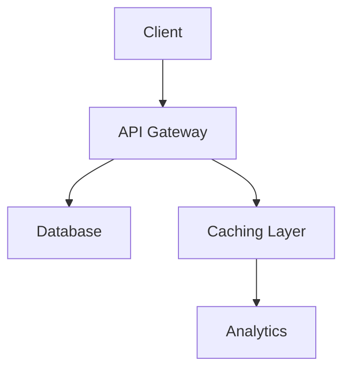

# Dynamic Documentation Modernization Plan

## 1. Prioritized Documentation Tasks
- [] Audit existing documentation gaps (API references, setup instructions)
- [] Identify outdated technical specifications in chatbot guide
- [] Map undocumented code components (components/ProjectDashboard.jsx)
- [] Prioritize modules by complexity and usage frequency
- [] Add accessibility compliance documentation (referencing accessibility.md)

## 2. Code Cross-References
- **Chatbot Guide**: src/pages/api/contact.ts
- **Architecture Overview**: src/layouts/BaseLayout.astro
- **API References**: src/components/ProjectSpecificViz.jsx
- **Setup Instructions**: src/content/config.ts
- **Accessibility**: documentation/accessibility.md
- **Component Library**: src/components/

## 3. Required Document Updates
| Document | Update Type | Status | Owner |
|---------|------------|-------|-------|
| chatbot_guide.md | Add WebSocket implementation details | Pending | Dev Team |
| ProjectDashboard.md | Update state management flowchart | In Progress | Lead Dev |
| deployment.md | Modernize CI/CD pipeline description | Pending | DevOps |
| accessibility.md | Add ARIA roles documentation | Completed | QA Team |
| contributing_roadmap.md | Sync with new style guide | Pending | Maintainers |
| api_references.md | Create Swagger/OpenAPI template | In Progress | API Team |

## 4. Tool Selection Matrix
| Documentation Type | Tool | Hosting | Version Control |
|---------------------|------|---------|-----------------|
| API References | Swagger/OpenAPI | ReadTheDocs | Git tags |
| User Guides | Markdown | GitHub Pages | Branch protection |
| Architecture | Mermaid.js | Figma Integration | Live sync |
| Code Comments | JSDoc | API Docs Portal | CI validation |
| Documentation Linting | Markdownlint | CI Pipeline | Git hooks |

## 5. Style Guide & Templates
**API Documentation Template:**
```markdown
## [Endpoint Name]
### URL
`[GET/POST] /api/[endpoint]`

### Request Parameters
| Parameter | Type | Description | Required |
|----------|------|-------------|----------|

### Response
```json
{
  "status": "success",
  "data": {}
}
```

**Mermaid.js Architecture Diagram Template:**

